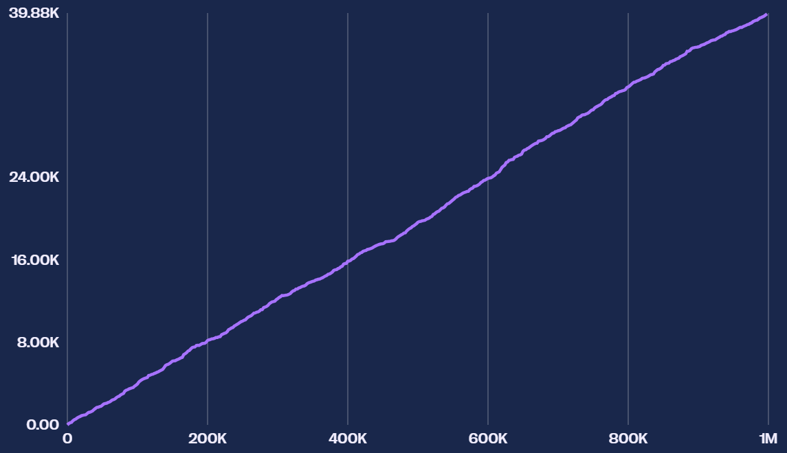

# Round-1-Algorithms
I found the code used by the global second place team in Prosperity 2 in 2024. Using there code as a template I began to modify the code based on the new historical data given by the stocks.

The first round included 3 types of different stocks:

1. Rainforest Resin
Rainforest Resin exhibited a mean-reverting price pattern, making it straightforward to trade. I employed a fixed fair value a the price of 10,000 seashells, capitalizing on its stable value.

2. Kelp
Kelp's price exhibited volatility over time, with occasional upward trends. I utilised a mean reversion strategy where a rolling fair value was added to the stock in order to optimise profits.

3. Squid Ink
Squid Ink's price was highly volatile, with significant price spikes. I experimented with implementing both breakout and momentum strategies which would have been much more productive than the similar mean reversion that I applied to the Kelp however I ran out of time and needed to focus on the newly released stocks.

Results:

During the first round I failed to trade squid ink (It was implemented in round 2) and adjust position limits which heavily effected profit margins however the Trading Bot still made good profits.